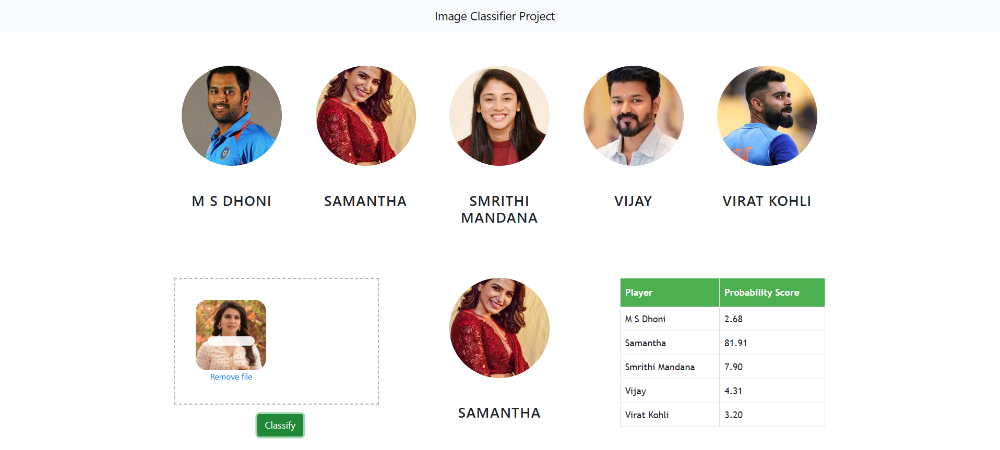

#Image Classifier Web Application

This project is a web-based image classification application built using Python, Flask, OpenCV, and Machine Learning.
It allows users to upload an image through a simple web interface, detects a face in the image, and classifies it into predefined categories using a trained machine learning model.

The project demonstrates how to integrate a machine learning pipeline with a web application, covering both frontend and backend development.

 Features:

-Upload images using drag & drop (Dropzone.js)
-Face detection using OpenCV Haar Cascades
-Feature extraction using Wavelet Transform
-Image classification using a trained ML model
-REST API built with Flask
-Simple and responsive web UI

 Technologies Used
--Backend

  -Python

  -Flask

  -OpenCV

  -NumPy

  -scikit-learn

--Frontend

  -HTML

  -CSS

  -JavaScript

  -Bootstrap

  -Dropzone.js

### Home Page

### Classification Result

